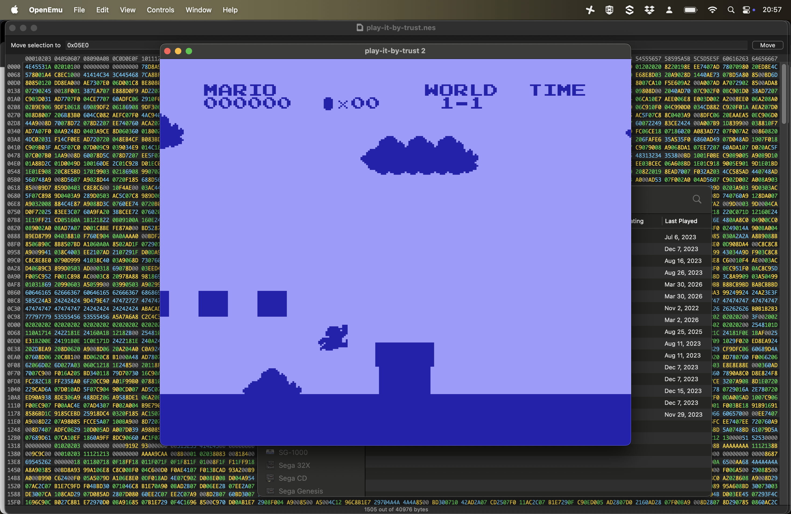

# Journal

## Journal it by trust (2026-03-31)

### The practical story

Well everything is backwards here in Pippinland. I've "made" the vast majority of this "game" and even prepped release-oriented stuff prior to journaling. There's writing in the commits that captures ideas and moments, but not a great big ton of reflection. I suppose I just wanted to make the thing and move on, it's meant to be a small project not a Whole Thing.

So what is it in the end? It's a "ROM hack" of Super Mario Bros. (in the most minimal sense) that changes every colour in the game to the "sky blue" of the overworld sky, which is actually kind of purple. I started out making it all white and then it turned out that maybe that could be read as leaning a bit "white supremacist" because of the name "White Super Mario Bros." which... fair enough. Rilla suggested making it all brown, I went with sky blue because I felt like maybe that has an "airy quality" that is somehow useful? Appropriate?

And so there we go. I do have a nice interim screenshot that shows other potentials of this, leading to a silhouette version of Mario, but I'm pretty sure I've seen that done before anyway. Nonetheless:

It's pleasing to the eye, and even better in play.

### Yoko Ono

A major part of the point of this was to make a videogame version of Yoko Ono's *Play It By Trust (White Chess Set)* from 1966. And then just to "see what happens" when you do. *Super Mario Bros.* seemed kind of like the equivalent to chess in terms of the tradition of videogames, so that was the target - plus there's a history of modding that game, including in an art context with good ol' Cory Archangel.

So let's read what [Yoko Ono has to say about her work](https://www.imaginepeace.com/archives/24764) and compare notes a bit with how the Mario version relates and doesn't relate?

> Play it for as long as you can remember  
> who is your opponent and  
> who is your own self.

So there's that key idea of forgetting who is who - and that's super important in chess because it's two player "war." Immediate tendrils out to all those sorts of "why are we fighting? we are the same?" kinds of ideas that come from there. Whereas in Sky Blue Mario that's not an issue as there's only one player... it's still potentially about "memory" in the sense of being able to simulate and remember the level in your head to know where you are? But not *who* you are (you're Sky Blue Mario for sure).

Chess is also a game of total information - even all in white - in the sense of the status of the board. You *can see* all of the pieces and speculate about which are yours, you can forget, but the pieces are there. I suppose loosely speaking there is a "truth" about which pieces are yours as well, even if neither player remembers? Or is that not the case. Meanwhile in Sky Blue Mario we're completely blind to what's happening (though we can hear) and there's basically no information at all to interpret (outside of sound, which becomes important if deeply imperfect). You can "feel your way around" to some extent by listening. You know if you hit a goomba, or fall, or jump. But not much more. 

And yet the underlying state of the game is *totally preserved* in the code. From the perspective of the machine the game is running in *exactly* the same was as always, the player is just in the dark (well, in the sky blue). So there very much are underlying truths about the status of the game, what is touching what, which pixels are mario and which pixels are a goomba and which are a coin. These things are asserted and held to account by the code even if we can't perceive them directly. So you can forget where Mario is, but the NES knows absolutely.

> Life is not all black and white – you don’t know what is yours and what is theirs. You have to convince people what is yours. In the chess situation it is simple – if you are black, then black is yours. But this is like a life situation, where you have to play it by convincing each other.

Again there are two human players here, so you could convince the other person, or negotiate with them, or cooperate with them in shared memory to keep playing chess despite the complications. You could *trust* each other to play, to do your best to keep track and honestly answer whether that bishop is yours or not.

In Mario there's no real "convincing" to be done for the same reasons as above: the game *knows* and the player... doesn't? The player "queries" the game to attempt to know? You can't convince the computer that Mario is somewhere he's "not". Maybe this starts moving toward the word "trust" too, but let me see what else Ono says...

> Then there’s a moment when you feel like it really doesn’t matter which pieces are yours or the opponent’s.

I wonder if the "liberation" this would suggest is true of Sky Blue Mario? Liberated from the UI telling you you're dead or that you're poor, do you open up to a different kind of experience altogether Do you play a different game? A game of listening? Of sound effects and rhythm? Of feeling your way around an invisible world? A world of music...

> You start to really understand that it doesn’t matter. We’re together. We’re on the same side. You realize that it’s not important to win.

Maybe in Sky Blue Mario it's similarly not important to win – your chances of reaching the end (which you wouldn't see anyway) are basically zero right? I suppose you could TAS input a winning run and watch it play about in a single blue screen with the sound effects of victory?

It's not important to win is another liberation as above - if you can't win, if you can't really make progress in any strongly intentional way, then maybe it can be more improvisational? Seeing "what can be done" in this new context? Or rather hearing it, hearing what can be sung? But also there's this underlying knowledge of the physical simulation, too... it's not purely a mysterious input leading to music, you know the input goes into the physical simulation which yields the music. So you can try to feel the spaces, work out how to... it's not important to win, it might be a pleasure to navigate and sing.

> I have been betrayed by so many in my life. I still trust people, since that is easier for me. I am healthy because I trust. Not trusting is bad for the health of your mind and body.

Well we get to trust at the end. Trust doesn't really get applied to the game, but it's obviously present. It's obviously the question of two people playing and increasingly needing to trust each other to continue calmly, to keep track of pieces, not to lie, etc. That's if you want to finish the chess game underneath the white chess set. Or maybe there's a different kind of improv trust involved, where the trust leads to changes to how the game is played - I try a move where I move a piece incorrectly and you accept it and we trust in the sense of trying to move forward the greater game we're playing together?

And in Sky Blue Mario... well trust could point in a couple of directions.

You can have feelings of trust or distrust toward the game itself, the machine, the code, the implementation, the thing that makes the sounds and claims to draw pictures all in blue. Perhaps my most notable experience with the game was that when running it I found I had misgiving about whether it was "really working." Notably I felt like up and down weren't working on the menu (in fact they don't, you use select to change options) and I felt like the jump button was over-responsive when I pressed it, leading to too-rapid jumps (in fact I was pressing the turbo-jump button the emulator provides). That had me feeling uncertainty about whether the game that was running in the browser was really the game I thought it was - I had what like evidence it was misbehaving and so I started losing trust. In my case that mostly led me to need/want to fix things because I wanted to release "the real game", so I replayed with a ROM that still had visible graphics and confirmed the mistakes/misinterpretations I was making and so was able to trust again.

You could also have feelings of trust or distrust toward the designer (me). Obviously I don't feel that, but a player could reasonably wonder if I'm making the whole thing up I guess? Just displaying a blue square and playing random sound effects, or just sound effects, with no underlying world/physical simulation. I suspect not many people would land there because it would just be so much effort for me to do that instead of what I say I'm doing (and am doing).

So where do I get to?

I think the stand-out little bits here are:

- Yes, I actually did feel my trust was shaken by unexpected output (sounds) when I played the game and couldn't see what was happen. It was disorienting.
- I do think there's something to Ono's idea that taking away the differentiation (of player for her, of world for me) can lead to a kind of liberation, and maybe at its best or most willing a kind of rethinking/reengagement with a game's rules/world under new terms.

Which is nice right?